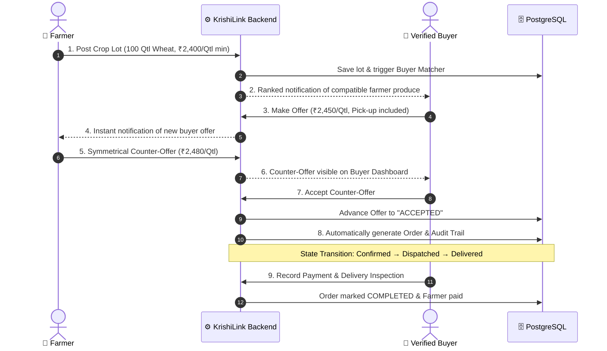
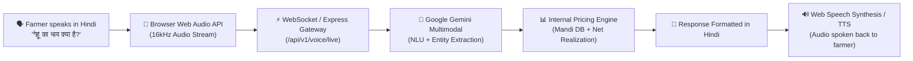
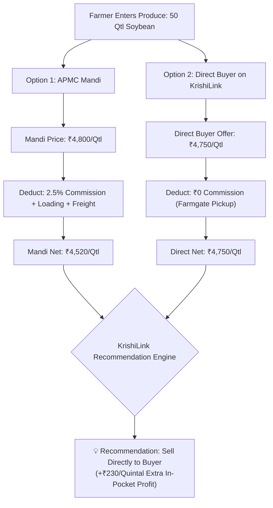

# 🌾 KrishiLink AI — Presentation Architecture & Workflows
> **Smart India Hackathon (SIH Problem Statement 26132)**  
> *Strengthening market linkages and price discovery for farmers.*

---

## 1. System Architecture Diagram (4-Tier Separation)

```mermaid
graph TB
    subgraph Tier1["1. Presentation Tier (Mobile & Hindi-First)"]
        FarmerUI["🌾 Farmer Portal<br/>(Voice, Lots, Mandi Prices)"]
        BuyerUI["🛒 Buyer Dashboard<br/>(Requirements, Counter-Offers)"]
        FpoUI["🏢 FPO Aggregator<br/>(Bulk Pooling & Logistics)"]
        AdminUI["🔐 Admin Console<br/>(Audit Logs & Verification)"]
    end

    subgraph Tier2["2. API Gateway & Core Engine (Node.js / Express)"]
        Gateway["Express API Gateway & Router"]
        AuthModule["JWT Auth & Role-Based Access Control (RBAC)"]
        TradingEngine["Deterministic Trading & Symmetrical Offer Engine"]
        NetRealization["Net Realization & Cost Calculator (No AI Drift)"]
        BuyerMatcher["Rule-Based Buyer Matching Engine"]
        VoiceSocket["WebSocket Live Audio Server (ws / 16kHz PCM)"]
    end

    subgraph Tier3["3. Intelligence & External Services Tier"]
        GeminiAPI["Google Gemini 1.5 / Flash<br/>(Hindi NLU, Intent & Audio TTS)"]
        PythonAI["Python FastAPI Microservice<br/>(ARMA Price Forecasting & Pandas)"]
    end

    subgraph Tier4["4. Data & Persistence Tier"]
        PostgresDB[("Neon Cloud PostgreSQL<br/>13-Table Schema (ACID Compliant)")]
        MemoryFallback[("In-Memory Demo Store<br/>Zero-Downtime Fallback")]
    end

    FarmerUI & BuyerUI & FpoUI & AdminUI -->|REST HTTPS| Gateway
    FarmerUI <==>|WebSocket WSS (PCM Streaming)| VoiceSocket
    Gateway --> AuthModule
    Gateway --> TradingEngine
    Gateway --> NetRealization
    Gateway --> BuyerMatcher
    VoiceSocket --> GeminiAPI
    Gateway -->|HTTP REST| PythonAI
    Gateway -->|pg pool| PostgresDB
    Gateway -.->|Auto-fallback if offline| MemoryFallback
```

---

## 2. End-to-End Trading & Symmetrical Counter-Offer Lifecycle



---

## 3. Multimodal Hindi Voice Assistant Pipeline



---

## 4. Farmgate Net Realization vs. Mandi Cost Model


